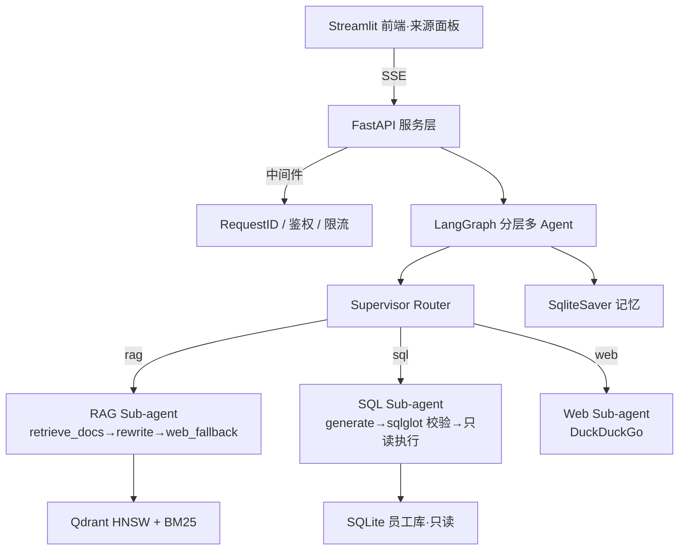

# FinCopilot · 多源自适应财务分析师 Copilot

> 一个能自动判断"用户问题该查哪条路"的财务分析师智能体：**RAG 财报文档 / SQL 员工库 / Web 实时信息**三路自动路由，企业级工程化交付。


## 特性

- 🧠 **分层多 Agent**：Supervisor Router 确定性路由 + 三个 Sub-agent 自主执行（含跨模式 fallback）
- 📊 **企业级混合检索**：双路召回（Qdrant 稠密 + BM25 稀疏）→ RRF 融合 →（cross-encoder 精排待 OQ-6）
- 🔒 **纵深防御**：SQL 仅 SELECT（sqlglot AST 校验 + 表白名单 + 物理只读连接）、API Key 鉴权、限流
- 💬 **多线程记忆**：`thread_id` 跨轮续聊，支持跟进问题
- ⚡ **SSE 流式**：逐 token 输出，实时可见
- 📈 **可观测**：structlog JSON 日志 + 可选 Langfuse tracing
- 🐳 **一键部署**：`docker compose up`（api + qdrant）

## 架构



## 三步运行

```bash
# 1. 准备环境（API_KEYS 等）
cp .env.example .env

# 2. 一键起服务（api + qdrant）
docker compose up --build

# 3. 验证
curl http://localhost:8000/v1/health
# → {"status":"ok","version":"0.1.0"}
```

API 文档：http://localhost:8000/docs

## 示例对话

```bash
curl -N -X POST http://localhost:8000/v1/chat \
  -H "Content-Type: application/json" \
  -d '{"question": "What was Amazon'"'"'s revenue in 2023?"}'
```

```json
{"event":"meta","data":{"route":"rag","model":"qwen3"}}
{"event":"delta","data":{"content":"Amazon's revenue (total net sales) in 2023 was **$574.785 billion**."}}
{"event":"sources","data":{"sources":[{"company":"amazon","doc_type":"10-k","fiscal_year":2023,"page":38}]}}
```

## 开发

```bash
uv sync --extra dev
source .venv/bin/activate
ruff format . && ruff check .
pytest                          # 离线可跑（LLM/Qdrant 已 mock）
python -m tests.eval.run --filter rag --sample 1   # 金标评估
```

## 项目结构

```
app/
├── main.py          # FastAPI 入口（lifespan + 中间件）
├── api/             # chat(SSE) / threads / ingest / health
├── services/        # chat / thread / ingest 业务编排
├── agents/          # LangGraph 分层多 Agent（supervisor + rag/sql/web）
├── tools/           # retriever(混合检索) / sql(纵深防御) / web / retrieval
├── core/            # config / llm / middleware / logging / tracing
└── schemas/         # Pydantic 模型
scripts/seed_docs.py # 财报 PDF 摄入脚本
tests/               # pytest + eval 金标集
```

## 里程碑

| 里程碑 | 状态 |
|---|---|
| M0 项目骨架 | ✅ |
| M1 核心多源 Agent 图 | ✅ |
| M2 FastAPI 服务化 | ✅ |
| M3 企业层 | ✅ |
| M4 数据打磨 | ✅ |
| M5 测试与评估 | ✅ |
| M6 发布 | 🔨 |

详见 [PROJECT_PLAN.md](PROJECT_PLAN.md)（项目唯一事实来源）。
